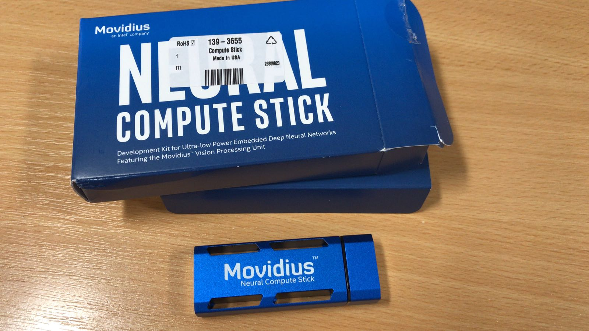

# mire add
Notes from early forrays into programming neural nets using Intel Movidius Neural Compute Stick

This was previously known as `movidius-ncs-notes`, but the name changed to mire add

* a play on words with the name of the VPU chip `Myriad`
* mire is spanish for `To Look` and add is computation
* it makes it a lot easier to google :)

